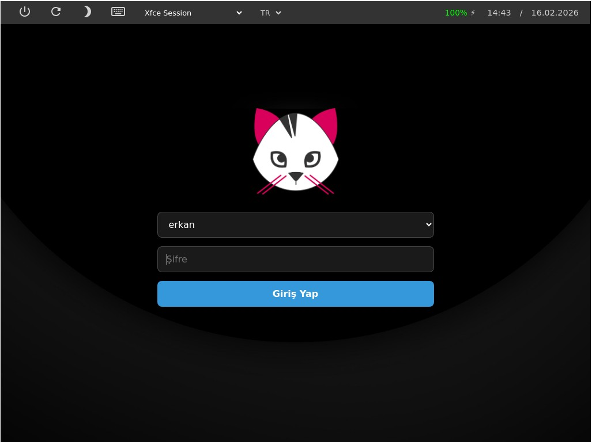

# Pisi Linux ligthdm nody-greeter teması



Pisi Linux için modern ve kullanıcı dostu bir web greeter teması.

## Özellikler

- **Modern Arayüz**: Temiz ve minimalist tasarım
- **Kullanıcı Yönetimi**: Çoklu kullanıcı desteği
- **Oturum Seçimi**: Farklı masaüstü ortamları desteği
- **Sanal Klavye**: Dokunmatik ekranlar için klavye desteği
- **Çok Dilli Destek**: Türkçe ve İngilizce dil seçeneği
- **Responsive Tasarım**: Farklı ekran çözünürlüklerine uyum

## Kurulum

1. Pisi Linux'ta lightdm ve nody-greeter'i yükleyin:
   ```bash
   sudo pisi it lightdm
   sudo pisi it nody-greeter
   ```

2. Tema dosyalarını LightDM teması dizinine kopyalayın:
   ```bash
   sudo cp -r /path/to/pisi-theme /usr/share/web-greeter/themes/pisilinux-lightdm-theme
   ```

3. LightDM yapılandırma dosyasında sessionu seçin:
   ```bash
   sudo nano /etc/lightdm/lightdm.conf
   ```
   
   Aşağıdaki satırları ekleyin/kontrol edin:
   ```
   [Seat:*]
   greeter-session=nody-greeter
   ```
   Tema. içinde web-greeter.yml dosyasını açın ve "theme" olarak ayarlayın.
   ```bash
   sudo nano /etc/lightdm/web-greeter.yml açın ve 
   theme: pisilinux-lightdm-theme olacak şekilde ayarlayın.
   ```


4. LightDM'i yeniden başlatın:
   ```bash
   sudo service lightdm restart
   ```

## Özelleştirme

### Renkler ve Tema
CSS değişkenleri `main.css` dosyasında özelleştirilebilir:
- Ana renk paleti
- Buton stilleri
- Arka plan görselleri

### Logo Değiştirme
`assets/media/pisi-logo-magenta.png` dosyasını değiştirerek logo özelleştirilebilir.

### İkonlar
`assets/media/icons/` dizinindeki SVG dosyaları değiştirilebilir:
- `shutdown.svg` - Kapatma ikonu
- `restart.svg` - Yeniden başlatma ikonu
- `suspend.svg` - Uyku ikonu
- `keyboard.svg` - Sanal klavye ikonu

### Katkıda Bulunma
1. Bu depoyu fork'layın
2. Yeni özellik branch'ı oluşturun
3. Değişiklikleri gönderin
4. Pull request oluşturun

## Lisans

MIT Lisansı - detaylar için LICENSE dosyasına bakın.

## Sürüm Bilgisi

- **Sürüm**: 1.0.0
- **LightDM Uyumluluğu**: Web Greeter
- **Minimum Sistem**: Pisi Linux 2.0+

## İletişim
Sorunlar ve öneriler için:
- GitHub Issues: Proje deposunda issue oluşturun
- Pisi Forumları: Resmi Pisi destek kanalları
